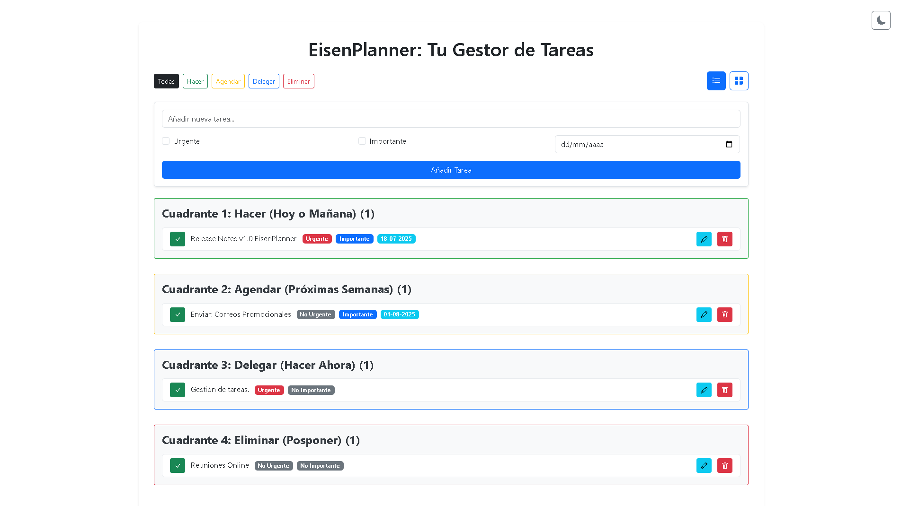
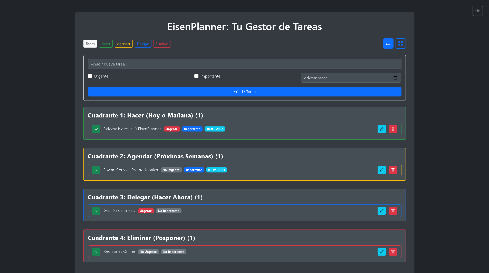
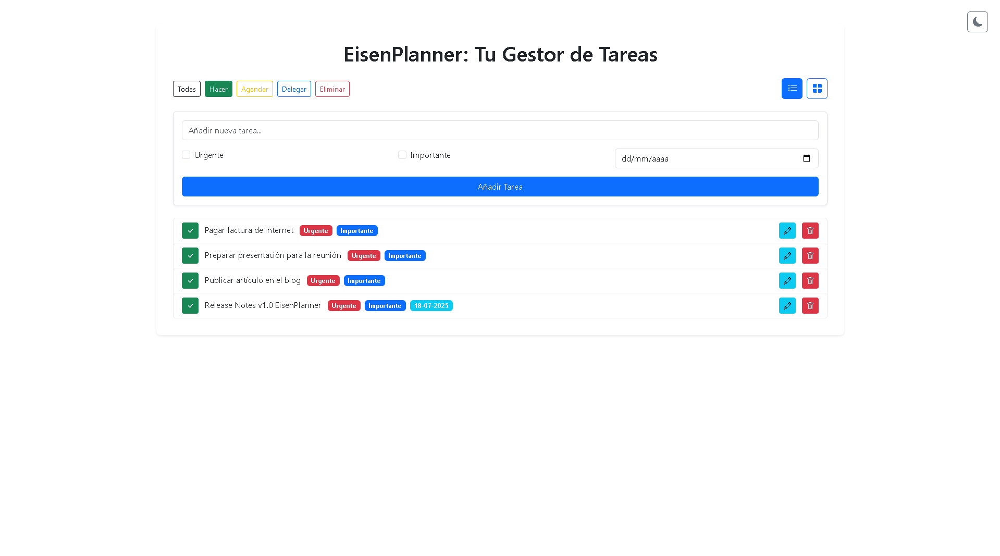
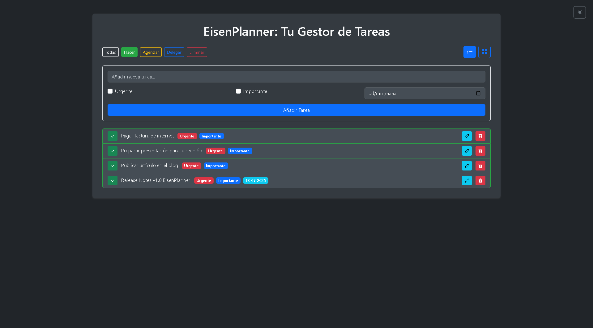
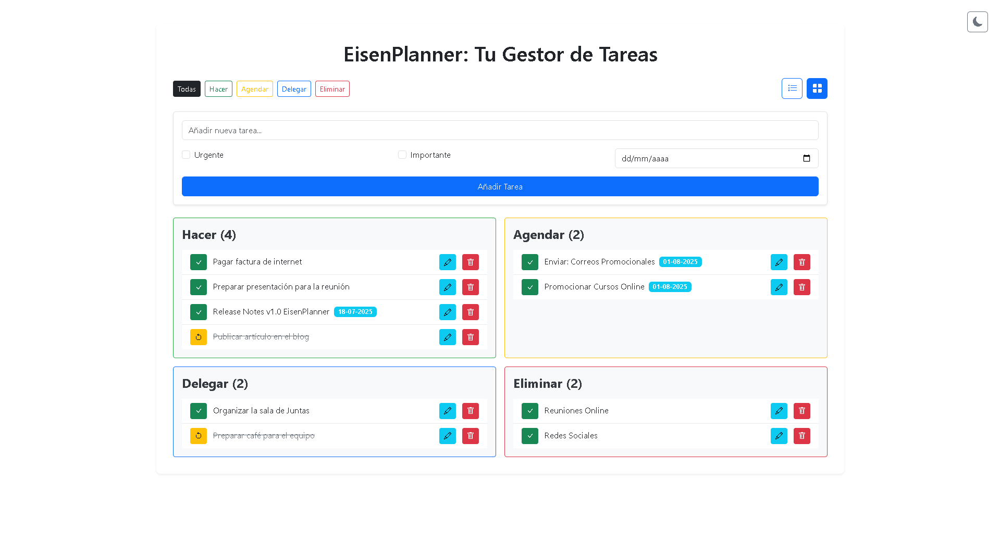
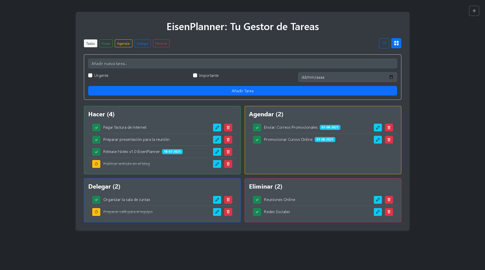
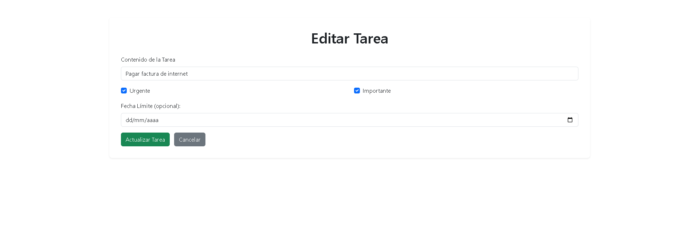
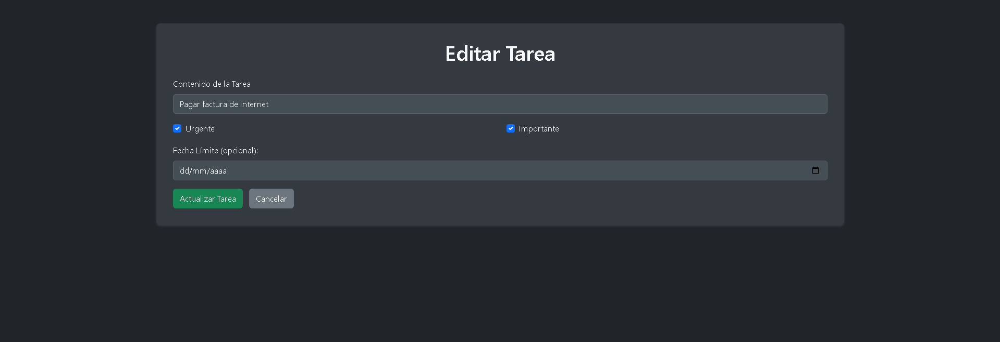

# Eisenplanner: Tu Gestor de Tareas Esencial

## Descripción del Proyecto

EisenPlanner es una aplicación web intuitiva diseñada para ayudarte a organizar tus tareas usando la **Matriz de Eisenhower**. Esta herramienta te permite clasificar tus pendientes en cuatro cuadrantes (Hacer, Agendar, Delegar, Eliminar) según su urgencia e importancia, facilitando la priorización y la gestión efectiva de tu tiempo.

Desarrollada con **Flask** para el backend y **Bootstrap 5** para una interfaz responsiva y moderna, EisenPlanner es una solución sencilla pero poderosa para mantenerte productivo y enfocado en lo que realmente importa.

---

## 📦 Origen del proyecto

Este proyecto nace como una evolución del código de [Flasktasker v2.0](https://github.com/ingwplanchez/flasktasker.git), específicamente de la rama `db-integration`, que incluye funcionalidades de persistencia y gestión de tareas mediante base de datos con Flask.

> 🔁 Se reutilizó esta base para construir Eisenplanner como un proyecto independiente y enfocado en productividad personal.

---

## ⚙️ Tecnologías usadas

* **Backend:**
    * Python 3
    * Flask
    * SQLite (para la base de datos local)
    * SQLAlchemy (ORM para la interacción con la base de datos)
* **Frontend:**
    * HTML5
    * CSS3 (Estilos personalizados y overrides de Bootstrap)
    * JavaScript
    * Bootstrap 5.3.3
    * Bootstrap Icons 1.11.3

---

## 🚀 Características (versión inicial)

- CRUD de tareas usando Flask y SQLAlchemy
- Estructura adaptable para nuevas funcionalidades
- Base lista para integrar la matriz de Eisenhower

---

## 🎯 Características Principales

* **Clasificación de Tareas con la Matriz de Eisenhower:**
    * **Hacer (Urgente e Importante):** Tareas que requieren atención inmediata.
    * **Agendar (Importante, No Urgente):** Tareas cruciales que deben planificarse.
    * **Delegar (Urgente, No Importante):** Tareas que se pueden asignar a otros.
    * **Eliminar (No Urgente, No Importante):** Tareas que no contribuyen a tus objetivos y pueden descartarse.
* **Gestión Completa de Tareas (CRUD):**
    * **Crear:** Añade nuevas tareas con su respectivo nivel de urgencia e importancia.
    * **Leer:** Visualiza todas tus tareas filtradas por cuadrante o en una lista consolidada.
    * **Actualizar (Editar/Completar):** Edita el contenido de las tareas y marca si están completadas o pendientes.
    * **Eliminar:** Borra tareas que ya no necesitas.
* **Múltiples Vistas de Tareas:**
    * **Vista de Lista:** Presenta las tareas agrupadas por cuadrante en un formato de lista vertical.
    * **Vista de Matriz 2x2:** Ofrece una representación visual directa de los cuatro cuadrantes, mostrando las tareas dentro de su clasificación correspondiente.
* **Filtrado Rápido:** Botones de filtro para ver rápidamente las tareas de un cuadrante específico (Hacer, Agendar, Delegar, Eliminar) o todas las tareas.
* **Modo Oscuro/Claro:** Alterna entre un tema de interfaz claro y oscuro para una experiencia de usuario cómoda en cualquier entorno de iluminación. La preferencia se guarda localmente en el navegador.
* **Interfaz Responsiva:** Adaptada para funcionar y verse bien en dispositivos de diferentes tamaños, desde computadoras de escritorio hasta teléfonos móviles.

---
## Capturas de Pantalla
Aquí puedes ver Eisenplanner en acción, mostrando sus diferentes vistas y el soporte para el modo claro y oscuro.

### Vista de Lista 

#### Modo Claro:


#### Modo Oscuro:


### Filtro por Cuadrante

#### Modo Claro:


#### Modo Oscuro:


### Vista de Matriz (Eisenhower)

#### Modo Claro:


#### Modo Oscuro:


### Edición de Tarea

#### Modo Claro:


#### Modo Oscuro:


---

## ✅ Mejoras Implementadas

- [x] Visualización interactiva de tareas según cuadrantes.
- [x] Etiquetado automático por urgencia/importancia.
- [x] Vista de Lista y de cuadrantes.
- [x] Fechas límite (Ley de Parkinson).
- [x] Tareas ordenadas por fecha de vencimiento.
- [x] Modo Oscuro.

---

## 🌱 Próximos Pasos

- Sección de Tareas completadas (Opcional).
- Perfil de invitado (Sin persistencia de Datos).
- Autenticación de usuarios (Con persistencia de Datos).

---

## Cómo Ejecutar el Proyecto Localmente

Para configurar y ejecutar EisenPlanner en tu máquina local, sigue estos pasos:

1.  **Clona el repositorio:**
    ```bash
    git clone https://github.com/ingwplanchez/eisenplanner.git
    cd EisenPlanner
    ```

2.  **Crea un entorno virtual (recomendado):**
    ```bash
    python -m venv venv
    ```

3.  **Activa el entorno virtual:**
    * En Windows:
        ```bash
        .\venv\Scripts\activate
        ```
    * En macOS/Linux:
        ```bash
        source venv/bin/activate
        ```

4.  **Instala las dependencias:**
    ```bash
    pip install -r requirements.txt
    ```
    (Asegúrate de tener un archivo `requirements.txt` en la raíz de tu proyecto con `Flask` y `Flask-SQLAlchemy` listados).

5.  **Inicializa la base de datos:**
    ```bash
    python -c "from app import db; db.create_all()"
    ```
    (Esto asume que tu archivo principal de Flask se llama `app.py` y que `db` está definido allí).

6.  **Ejecuta la aplicación:**
    ```bash
    flask run
    ```

    Si tu archivo principal de Flask no se llama `app.py`, necesitarás establecer la variable de entorno `FLASK_APP` antes de `flask run`:
    * En Windows (CMD):
        ```bash
        set FLASK_APP=nombre_de_tu_app.py
        flask run
        ```
    * En Windows (PowerShell):
        ```powershell
        $env:FLASK_APP="nombre_de_tu_app.py"
        flask run
        ```
    * En macOS/Linux:
        ```bash
        export FLASK_APP=nombre_de_tu_app.py
        flask run
        ```

7.  **Accede a la aplicación:**
    Abre tu navegador web y ve a `http://127.0.0.1:5000/`.

---

## Estructura del Proyecto (Ejemplo)

```
EisenPlanner/
├── venv/
├── app.py              # Archivo principal de Flask
├── requirements.txt    # Dependencias del proyecto
├── instance/           # Base de datos SQLite (generada al ejecutar db.create_all())
│   └── eisenplanner.db
├── templates/
│   └── index.html      # Plantilla principal
│   └── edit_task.html  # Plantilla para editar tareas (si existe)
└── static/
    ├── css/
    │   └── styles.css  # Archivos CSS personalizados (si existen)
    └── icons/          # Íconos de la aplicación (si existen)
        └── icon-192x192.png
        └── ...
```

---

## 📝 Créditos

- 🛠️ Base de código reutilizada de [Flasktasker v2.0](https://github.com/ingwplanchez/flasktasker.git), desarrollada originalmente como una herramienta de gestión de tareas simple.
- 🎯 Eisenplanner evoluciona esta idea hacia una herramienta de productividad estratégica basada en la matriz de Eisenhower.

---

## 📄 Licencia

Este proyecto está bajo la licencia [MIT](https://es.wikipedia.org/wiki/Licencia_MIT), lo que permite su uso y modificación libre siempre que se otorgue el debido crédito.

